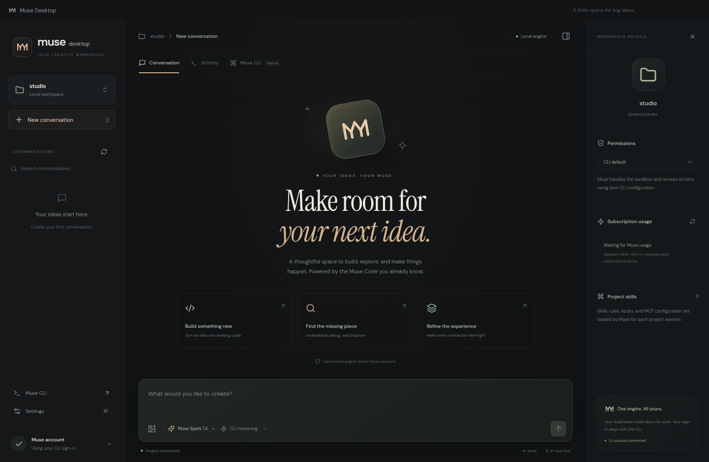
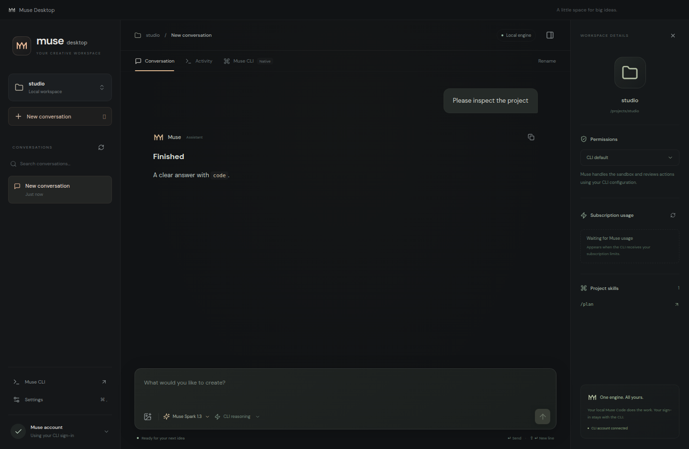

# Muse Desktop 0.2

A modern desktop workspace powered by your installed **Muse Code**, using the official Muse SDK. Windows is the primary packaged target.



## Your Muse account, already connected

If you are signed in to the Muse CLI, open the desktop app and it reuses that login through the CLI’s own credential backend. Credentials are never copied into the renderer or stored in desktop settings.

If you are not signed in, choose **Sign in with Muse Code**. The app requests a native device code and opens the verification page in your browser. Older CLI versions fall back to a visible native sign-in terminal. You can also sign in from the integrated **Muse CLI** tab, then refresh the account.

This desktop targets Muse account authentication. It removes an ambient `META_API_KEY` when starting Muse and blocks GUI turns if the CLI reports stored API-key authentication. A signed-in account does not itself guarantee subscription entitlement; Muse’s service controls access and billing.

## Two views of the native engine

- **Conversation:** streamed Markdown, images, model and reasoning selection, queued follow-ups, stop, retained project history, rename, compaction, structured approvals and questions, skill selection and subscription usage when available.
- **Activity:** native tool, shell, reasoning, workflow and subagent items, expandable output and patch summaries.
- **Muse CLI:** the original interactive CLI embedded in the desktop window through a real PTY. Use its complete native command set, trust prompts, configuration and features that do not have a dedicated GUI control. The terminal stays alive when switching tabs.

The GUI and terminal are separate native sessions. They share the CLI’s account, configuration and retained history. An active session owned by another Muse process is displayed read-only until that process releases it.

Project rules, skills, hooks, MCP configuration, sandboxing and approval policy are loaded and enforced by Muse. The desktop does not implement a second agent or bypass approvals.



## Install on Windows

1. Download the installer from the latest successful **Muse Desktop Windows** run in [GitHub Actions](https://github.com/artfckt/muse-code-desktop/actions/workflows/windows-build.yml), under the `muse-code-desktop-windows` artifact.
2. Install Muse Code from the [official documentation](https://dev.meta.ai/docs/muse-code) if it is not installed.
3. Open Muse Desktop, connect your account if necessary and select your project folder.

The app searches the official installation locations as well as `PATH`. If your CLI is installed elsewhere, use **Settings → Locate CLI**. The CLI is an external prerequisite and is not bundled in the installer. Account-dependent features require an eligible Muse account.

## Development

Use Node.js 22+ and an installed Muse CLI.

```bash
npm ci
npm run dev
```

## Verification and packaging

```bash
npm run typecheck
npm test
npx playwright install chromium
npm run test:ui
npm run build:win
```

Windows packaging rebuilds the native PTY for Electron and writes the NSIS installer to `release/`. The workflow also launches the packaged application and checks its sandboxed preload and native PTY binding before uploading the installer.

To run the optional real-CLI smoke tests, set `MUSE_TEST_BINARY` to the official Muse executable before `npm test`. These use an isolated home and the deterministic echo provider. See [validation details](docs/VALIDATION.md) for what is verified and what still requires a live account.

The screenshots above use test fixtures; they illustrate the implemented interface, not a paid model invocation. This is an independent desktop client, not an official Meta application.
