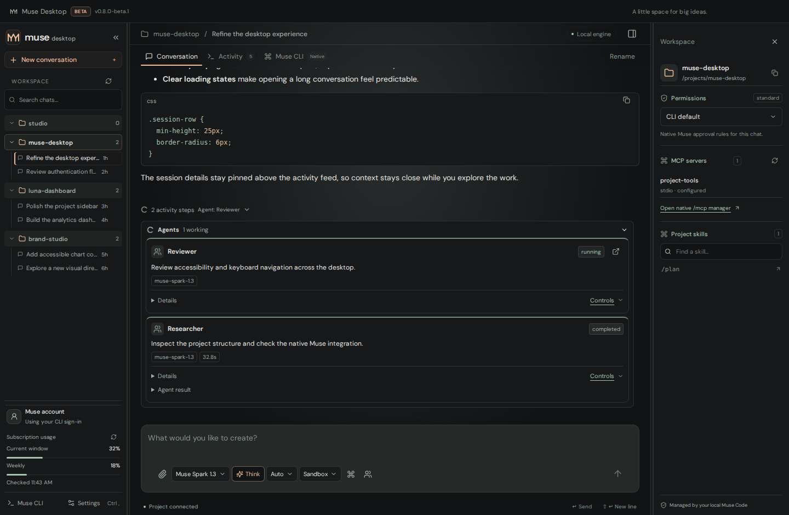
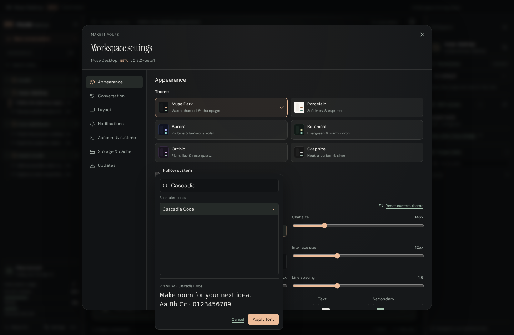

# Muse Desktop

A focused desktop workspace for **Muse Code**. Chat with the same native engine you use in the CLI, keep projects and conversations together, and follow tools, approvals and running agents inside your conversation.

**Current version: 0.8.0-beta.1 · Beta · Windows x64**

[Download the beta installer](https://github.com/artfckt/muse-code-desktop/releases/tag/v0.8.0-beta.1) · [Muse Code documentation](https://dev.meta.ai/docs/muse-code) · [Windows build checks](https://github.com/artfckt/muse-code-desktop/actions/workflows/windows-build.yml)


## Get started

1. Install [Muse Code](https://dev.meta.ai/docs/muse-code) and sign in with `muse login`.
2. Download `Muse-Desktop-0.8.0-beta.1-Windows-x64.exe` from the beta release and run the installer.
3. Open Muse Desktop. It reuses the CLI's existing account on this computer. If needed, choose **Sign in with Muse Code** inside the app.
4. Select **New conversation**, choose a project folder or **No folder**, and start chatting.

The Muse CLI is an external prerequisite; the installer does not bundle it. The app checks the usual installation locations as well as `PATH`. Use **Settings → Account & runtime → Locate CLI** for a custom installation. An eligible Muse account is required for account-dependent features. If the CLI cannot connect, the app offers **Locate Muse CLI** and **Retry**; sending stays disabled until the native runtime and account are ready. This beta installer is unsigned.

Muse Desktop is an independent client, not an official Meta application. Authentication and execution remain with the installed Muse Code runtime through the official `@muse-code/sdk`.

## A compact workspace

- **Projects and chats:** distinct folder headers and 25 px chat rows, search, active indicators and clear loading states. Collapse the sidebar to a 56 px project rail with an expand button and a fixed account/settings footer for more conversation space. Drag project headers or chats to reorder them; chat ordering stays within the native project. Keyboard users can reorder a focused header or chat with Alt + Up/Down. Conversation actions support rename, local archive/restore and Markdown export. Hide a project without deleting its files; search and the archived/hidden view keep its conversations discoverable.
- **Conversations:** streaming Markdown, code highlighting, tables, formulas, diagrams, copyable response text and a **Jump to latest** button for long histories. Text selection stays in conversations and editable fields. Draft text and attachments are saved per conversation, with scroll position preserved while switching chats. Long histories initially render the latest 200 messages, so a burst of tools cannot hide the conversation; **Show earlier messages** reveals more without discarding native history.
- **Activity:** a compact numbered event feed, running/failed filters and session details pinned above the scrolling feed. Inline steps stay collapsed while Muse works. Each group shows its current action; summaries supplied by Muse appear as visible updates. Opening details renders 50 steps at a time, with earlier steps available on demand. Model, permissions, tokens and context appear when Muse reports them.
- **Agents in chat:** a compact inline group shows running agents and their objectives alongside the messages. Expand it for native status, model, duration, results and controls. Reminder deliveries are treated as notifications and do not inflate agent counts. There is no separate Agents tab. A separate-window link appears only for a running agent whose conversation is available. Native message, follow-up, interrupt and resume controls remain available where supported.
- **Native Muse CLI:** an integrated terminal for the original interactive experience, including commands that have no desktop API. It starts in the selected conversation’s actual folder, including isolated no-folder chats. The terminal runs a separate native conversation; inserting a CLI command does not mutate the GUI conversation. Restart explicitly when changing its context.
- **Approvals:** native permission choices and structured questions, with isolated permission profiles for each root conversation.


The workspace inspector uses a compact project header, native permission controls, MCP configuration and a searchable skill list. Search covers every configured skill; **Browse all** opens the full list within the panel.



## Faster chat navigation

Recent conversations reuse their in-memory transcript and native host. A bounded local cache also restores up to 200 messages, 80 recent activity items and 20 agent records after restarting the app while Muse refreshes the authoritative history in the background. Sending waits for that refresh to finish. Disk previews retain up to 12 conversations, expire after seven days, and have a 16 MB total budget with a 2 MB per-conversation limit. Native history remains complete and available through **Show earlier messages** after synchronization.

The sidebar index is cached separately, streaming changes are batched per animation frame, and typing does not rebuild the project list. Formula and diagram engines load when needed, reducing the initial JavaScript bundle. The chat and input share the same column width, and user messages use the same typography as replies.

**Thinking mode** uses Muse's native reasoning effort. Toggle it off or choose an effort from the adjacent dropdown; supported behavior depends on the selected model and installed Muse runtime.

## Updates from GitHub

Open **Settings → Updates → Check for updates** to check this repository's GitHub Releases. Automatic checks run shortly after startup and every six hours, with cached requests and recoverable offline/rate-limit messages. Beta builds follow published beta and stable releases; stable builds follow stable releases. New versions appear in the sidebar and can trigger a desktop notification once per version. Automatic checks and update notifications can be disabled independently.

**Download update** opens the official release installer, or the release page if its installer is unavailable. Installation is manual; this beta does not silently replace the running application.

## Projects or no folder

**New conversation** lets you choose a recent project, browse for another folder, or select **No folder**. A no-folder chat receives its own empty directory inside the app's local data. It does not silently attach your home directory or the previous project. Its native history still persists and appears in the **No folder** group.

Each root GUI conversation runs in its own Muse host. Idle hosts are released as new chats are visited; running turns, background work, pending approvals and open agent views are protected. **Sandbox** uses native approval rules. **Read only** disables write and shell tools. **YOLO** explicitly uses `--disable-sandbox --trust-workspace` and `allowAll`. Changing a host profile requires its turn and agents to be idle; child agents inherit their parent's profile. See [Muse permissions](https://dev.meta.ai/docs/muse-code/permissions).


## Attach files, images and video

Use the paperclip, drop files into the composer, or paste an image.

| Attachment                                 | Limit      | How Muse receives it                                                |
| ------------------------------------------ | ---------- | ------------------------------------------------------------------- |
| PNG, JPG, WebP, GIF                        | 10 MB each | Native image input                                                  |
| MP4, WebM, MOV                             | 50 MB each | Four chronological image frames and the saved local video path      |
| Text, Markdown, JSON, CSV and source files | 25 MB each | A text excerpt of up to 100,000 characters and the saved local path |
| PDF, DOCX, XLSX and ZIP                    | 25 MB each | The saved local path for native file tools                          |

Attach up to eight files per message. Total inline document excerpts are capped at 200,000 characters; shortened excerpts are marked, and the complete local paths remain available to native file tools. Mixed batches keep valid files and report rejected files individually. Skill invocations receive document context as well as image inputs. Uploaded files stay local and remain associated with the conversation after reopening. Removing an unsent attachment cleans its staged copy. **Settings → Storage & cache** reports storage and can clean unused copies while keeping sent attachments and saved drafts. Reading binary documents depends on the installed Muse tools and the conversation's native permissions. Video support uses sampled frames rather than a native video input API.

## Themes, colors and fonts

**Muse Dark** and **Graphite** retain their original palettes. Four refreshed alternatives add **Porcelain**, **Aurora**, **Botanical** and **Orchid**, alongside automatic system appearance.

Settings are organized into Appearance, Conversation, Layout, Notifications, Account & runtime, Storage & cache, and Updates. Choose **Interface & chat font** to open a searchable list. Select a name, inspect the single preview, then click **Apply font**; Cancel leaves the current font unchanged. **Use default font** restores DM Sans. Code keeps its monospace font. Installed fonts load only when the picker is opened and are cached for the app session. The list renders a small window of names, avoiding simultaneous loading of hundreds of font faces. On Windows, names come from the system font collection. Custom colors have visual pickers and editable HEX values. **Reset custom theme** restores the selected palette and default typography; choosing another theme also clears appearance overrides. Conversation and account preferences stay saved.



## Subscription usage

Refresh reads usage observations from **all connected conversation hosts and the control host**, keeping the newest native observation. Older results cannot overwrite newer observations, and account changes invalidate previous-account snapshots. Current-window and weekly meters appear independently; an absent meter is not treated as zero usage. The compact meters sit below your Muse account in the left sidebar, beside Settings, and show the last check time. The workspace inspector keeps project controls and no longer duplicates subscription usage.

The native `usage/read` API returns the latest observation received by Muse; it does not initiate a billing request. If there is no observation, the app shows **No usage reported yet**. Use `/usage` in the integrated Muse CLI for the native usage view. Account-specific quota refresh still depends on the installed Muse runtime and service.

## Local data and privacy

The app shares the official CLI credential store without copying credentials into renderer storage. It does not require a separate desktop account. An ambient `META_API_KEY` is excluded from subscription host processes; the CLI credential backend remains intact. Existing API-key credentials are reported so you can switch to an account login.

Muse owns session history, skills, rules, hooks and MCP configuration. The desktop stores preferences, permission-profile choices, attachment metadata and no-folder workspaces in Electron's local user-data directory. Drafts, binary draft attachments and bounded conversation previews are stored locally in IndexedDB. **Storage & cache → Clear cache** removes previews without deleting Muse history or saved drafts. Agent windows use separate browser sessions and receive only their own conversation events, approved media and shared appearance settings. Attachment indexes and desktop settings use atomic writes and backups. Local previews require a trusted app window and a main-issued file grant; renderer IPC is restricted to trusted top-level documents. Files are not uploaded to a separate desktop service. Content sent through Muse follows Muse's own account and service behavior.

## Development

Use Node.js 22+, npm and an installed Muse CLI.

```bash
npm ci
npm run dev
```

```bash
npm run typecheck
npm test
npx playwright install chromium
npm run test:ui
npm run build:renderer
npm run test:electron
```

On a headless Linux server, run Electron checks with `xvfb-run -a npm run test:electron`. Set `MUSE_TEST_BINARY` to a Muse executable to enable isolated native echo-provider integration tests. Those tests make no paid model requests and do not use your account credentials.

Build the Windows installer on Windows:

```bash
npm run build:win -- --publish never
```

Or cross-build on a Linux VPS with Wine, Xvfb and rsync installed:

```bash
npm ci
bash scripts/build-windows-vps.sh
```

The VPS script builds in a temporary staging directory, uses the pinned package's Windows N-API PTY prebuilds, and writes the installer, blockmap and `SHA256SUMS.txt` to `release/`. The Windows workflow independently builds the app and checks the packaged renderer, sandboxed preload and native PTY.

To regenerate the screenshots, run `npm run build:renderer`, start the production preview with `npx vite preview --host 127.0.0.1 --port 5176`, then run `MUSE_PREVIEW_URL=http://127.0.0.1:5176 node tests/capture-screenshots.cjs` (or set that environment variable in PowerShell). Screenshots show the actual beta interface with illustrative conversation and agent data from the test-only bridge; that bridge is not included in production.

## This release

See [0.8.0-beta.1 release notes](docs/RELEASE-0.8.0-beta.1.md) for changes and verification. This release focuses on conversation visibility, inline agents, faster font selection and compact workspace panels.

## Beta status

The version and beta channel are visible in the title bar and settings. Muse's SDK is still at `0.x`, and native capabilities can vary with the installed CLI. Please include the desktop version, CLI version, Windows version and reproduction steps when reporting an issue. Avoid including credentials or private project content.
