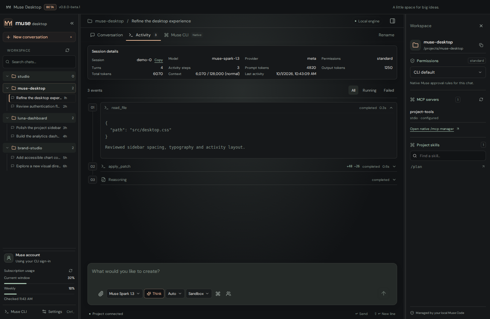
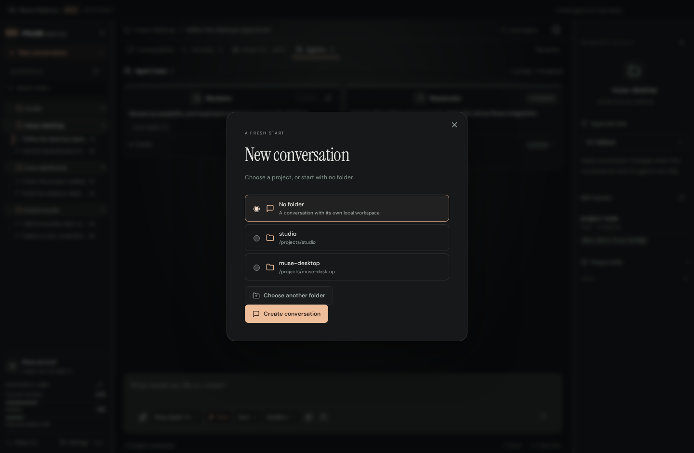
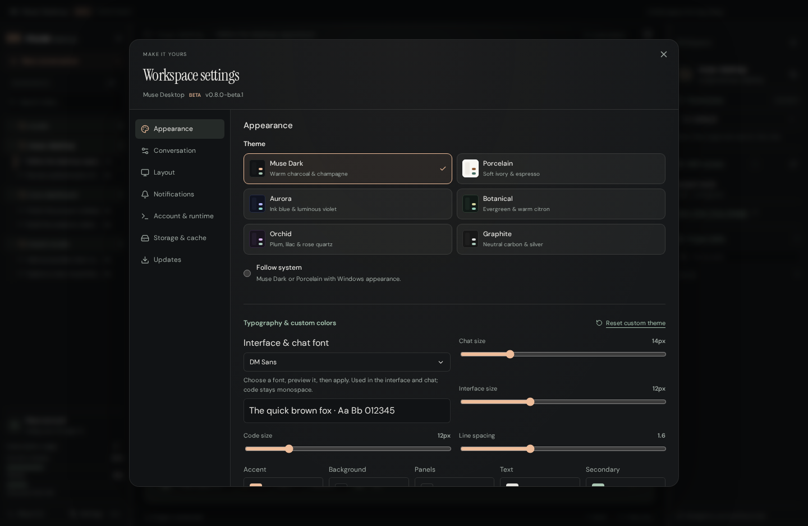

# Muse Desktop

A focused desktop workspace for **Muse Code**. Chat with the same native engine you use in the CLI, keep projects and conversations together, and follow tools, approvals and agents without leaving the app.

**Current version: 0.6.0-beta.1 · Beta · Windows x64**

[Download the beta installer](https://github.com/artfckt/muse-code-desktop/releases/tag/v0.6.0-beta.1) · [Muse Code documentation](https://dev.meta.ai/docs/muse-code) · [Windows build checks](https://github.com/artfckt/muse-code-desktop/actions/workflows/windows-build.yml)


## Get started

1. Install [Muse Code](https://dev.meta.ai/docs/muse-code) and sign in with `muse login`.
2. Download `Muse-Desktop-0.6.0-beta.1-Windows-x64.exe` from the beta release and run the installer.
3. Open Muse Desktop. It reuses the CLI's existing account on this computer. If needed, choose **Sign in with Muse Code** inside the app.
4. Select **New conversation**, choose a project folder or **No folder**, and start chatting.

The Muse CLI is an external prerequisite; the installer does not bundle it. The app checks the usual installation locations as well as `PATH`. Use **Settings → Locate CLI** for a custom installation. An eligible Muse account is required for account-dependent features. If the CLI cannot connect, the app offers **Locate Muse CLI** and **Retry**; sending stays disabled until the native runtime and account are ready. This beta installer is unsigned.

Muse Desktop is an independent client, not an official Meta application. Authentication and execution remain with the installed Muse Code runtime through the official `@muse-code/sdk`.

## A compact workspace

- **Projects and chats:** compact, collapsible project groups, search, active chat indicators and clear loading states. Conversation actions support rename, local archive/restore and Markdown export. Hide a project without deleting its files; search and the archived/hidden view keep its conversations discoverable.
- **Conversations:** streaming Markdown, code highlighting, tables, formulas, diagrams, copyable response text and a **Jump to latest** button for long histories. Text selection stays in conversations and editable fields. Draft text and attachments are saved per conversation, with scroll position preserved while switching chats. Long histories initially render the latest 200 items; **Show earlier messages** reveals more without discarding native history.
- **Activity:** expandable tool summaries and session details pinned above the scrolling feed, including model, permissions, tokens and context when Muse reports them.
- **Agents:** objectives, native status, model, IDs, paths, duration and results when available. A separate-window link appears only for a running agent whose conversation is available. Native message, follow-up, interrupt and resume controls remain available where supported.
- **Native Muse CLI:** an integrated terminal for the original interactive experience, including commands that have no desktop API. It starts in the selected conversation’s actual folder, including isolated no-folder chats. The terminal runs a separate native conversation; inserting a CLI command does not mutate the GUI conversation. Restart explicitly when changing its context.
- **Approvals:** native permission choices and structured questions, with isolated permission profiles for each root conversation.



## Projects or no folder

**New conversation** lets you choose a recent project, browse for another folder, or select **No folder**. A no-folder chat receives its own empty directory inside the app's local data. It does not silently attach your home directory or the previous project. Its native history still persists and appears in the **No folder** group.

Each root GUI conversation runs in its own Muse host. Idle hosts are released as new chats are visited; running turns, background work, pending approvals and open agent views are protected. **Sandbox** uses native approval rules. **Read only** disables write and shell tools. **YOLO** explicitly uses `--disable-sandbox --trust-workspace` and `allowAll`. Changing a host profile requires its turn and agents to be idle; child agents inherit their parent's profile. See [Muse permissions](https://dev.meta.ai/docs/muse-code/permissions).



## Attach files, images and video

Use the paperclip, drop files into the composer, or paste an image.

| Attachment                                 | Limit      | How Muse receives it                                                |
| ------------------------------------------ | ---------- | ------------------------------------------------------------------- |
| PNG, JPG, WebP, GIF                        | 10 MB each | Native image input                                                  |
| MP4, WebM, MOV                             | 50 MB each | Four chronological image frames and the saved local video path      |
| Text, Markdown, JSON, CSV and source files | 25 MB each | A text excerpt of up to 100,000 characters and the saved local path |
| PDF, DOCX, XLSX and ZIP                    | 25 MB each | The saved local path for native file tools                          |

Attach up to eight files per message. Total inline document excerpts are capped at 200,000 characters; shortened excerpts are marked, and the complete local paths remain available to native file tools. Mixed batches keep valid files and report rejected files individually. Skill invocations receive document context as well as image inputs. Uploaded files stay local and remain associated with the conversation after reopening. Removing an unsent attachment cleans its staged copy. **Settings → Local attachments** reports storage and can clean unused copies while keeping sent attachments and saved drafts. Reading binary documents depends on the installed Muse tools and the conversation's native permissions. Video support uses sampled frames rather than a native video input API.

## Themes, colors and fonts

**Muse Dark** and **Graphite** retain their original palettes. Four refreshed alternatives add **Porcelain**, **Aurora**, **Botanical** and **Orchid**, alongside automatic system appearance.

Settings include visual color pickers, editable HEX colors, typography controls and searchable fonts installed on the computer. On Windows, the font list comes from the system's installed font collection. Clear a custom color to use the selected theme again. Preferences are saved locally.



## Subscription usage

Refresh reads usage observations from **all connected conversation hosts and the control host**, keeping the newest native observation. Older results cannot overwrite newer observations, and account changes invalidate previous-account snapshots. Current-window and weekly meters appear independently; an absent meter is not treated as zero usage. The panel shows when the observation was received and when the app last checked.

The native `usage/read` API returns the latest observation received by Muse; it does not initiate a billing request. If there is no observation, the app shows **No usage reported yet** and offers **Open Muse usage** to prepare `/usage` in the integrated CLI. Account-specific quota refresh still depends on the installed Muse runtime and service.

## Local data and privacy

The app shares the official CLI credential store without copying credentials into renderer storage. It does not require a separate desktop account. An ambient `META_API_KEY` is excluded from subscription host processes; the CLI credential backend remains intact. Existing API-key credentials are reported so you can switch to an account login.

Muse owns session history, skills, rules, hooks and MCP configuration. The desktop stores preferences, permission-profile choices, attachment metadata and no-folder workspaces in Electron's local user-data directory. Drafts and binary draft attachments are stored locally in IndexedDB. Agent windows use separate browser sessions and receive only their own conversation events, approved media and shared appearance settings. Attachment indexes and desktop settings use atomic writes and backups. Local previews require a trusted app window and a main-issued file grant; renderer IPC is restricted to trusted top-level documents. Files are not uploaded to a separate desktop service. Content sent through Muse follows Muse's own account and service behavior.

## Development

Use Node.js 22+, npm and an installed Muse CLI.

```bash
npm ci
npm run dev
```

```bash
npm run typecheck
npm test
npx playwright install chromium
npm run test:ui
npm run build:renderer
npm run test:electron
```

On a headless Linux server, run Electron checks with `xvfb-run -a npm run test:electron`. Set `MUSE_TEST_BINARY` to a Muse executable to enable isolated native echo-provider integration tests. Those tests make no paid model requests and do not use your account credentials.

Build the Windows installer on Windows:

```bash
npm run build:win -- --publish never
```

Or cross-build on a Linux VPS with Wine, Xvfb and rsync installed:

```bash
npm ci
bash scripts/build-windows-vps.sh
```

The VPS script builds in a temporary staging directory, uses the pinned package's Windows N-API PTY prebuilds, and writes the installer, blockmap and `SHA256SUMS.txt` to `release/`. The Windows workflow independently builds the app and checks the packaged renderer, sandboxed preload and native PTY.

To regenerate the screenshots, run `npm run build:renderer`, start the production preview with `npx vite preview --host 127.0.0.1 --port 5176`, then run `MUSE_PREVIEW_URL=http://127.0.0.1:5176 node tests/capture-screenshots.cjs` (or set that environment variable in PowerShell). Screenshots show the actual beta interface with illustrative conversation and agent data from the test-only bridge; that bridge is not included in production.

## This release

See [0.6.0-beta.1 release notes](docs/RELEASE-0.6.0-beta.1.md) for changes and verification. Electron and the installer tooling have been updated; the full dependency audit reports zero known vulnerabilities at build time.

## Beta status

The version and beta channel are visible in the title bar and settings. Muse's SDK is still at `0.x`, and native capabilities can vary with the installed CLI. Please include the desktop version, CLI version, Windows version and reproduction steps when reporting an issue. Avoid including credentials or private project content.
